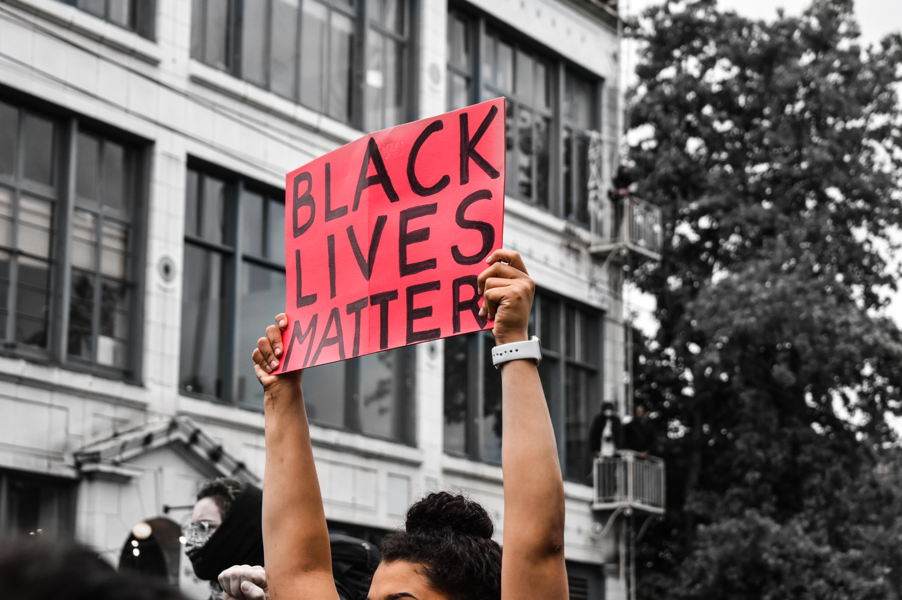

# Conversations Of Color On Twitter
##Final Story Map for Geog458

### Project Description
This story map ([view here](https://ttreat6.github.io/final_storymap/)) is an interactive story map of telling the conversation of "color" that is occuring on twitter right now. By using the twitter API, I gathered the tweets in two sections, one gathered using key words such as "BLM" and "Black Lives Matter" and are generally for the Black Lives Movements while the other section are gathered using key words such as "All lives Matter", "destructive", and AntifaTerrorists" and are all either agaisnt the movements or are "ignorant" to the issues. Using the tweets geolocated data, the are placed into two different maps. They are then used to compare to each other and a mini map placed on the left side that shows the lastest trends of party majorty per state.

### Project Goal
The goal of this story map is to look at the at the current black lives matter movement through a geospatial lense. Throughout the rapid growth of the BLM movement, claims have arose that those for the movement tend to belong to the democratic party while those against are republican. This storymap puts this to test by studying the spatial trends of pro and against BLM tweets and comparing it to a map of current party majority in each state. They story also has the additional goal of providing information about the movement and how and where to learn more and help the cause.

Visit the Black Lives Matter Website [here](https://blacklivesmatter.com/).

### Libraries and Sources
- [Bootstrap](https://getbootstrap.com/)
- [leaflet.ajax](https://github.com/calvinmetcalf/leaflet-ajax)
- [Chroma.js](https://gka.github.io/chroma.js/)
- Fonts by [Google Fonts](https://developers.google.com/fonts) and [Font Awesome](http://fontawesome.io/)
- Basemap by [Mapbox](https://www.mapbox.com/)
- [Twitter API](https://developer.twitter.com/en/docs)

### References
- Images of protests were taken and provided by myself.
  - One image in Opposition Section provided by [CNN](https://www.cnn.com/2020/06/08/us/girl-black-lives-matter-montana-agitator-trnd/index.html)
- Party Majority Map: [[1](https://www.270towin.com/)]
- Black Lives Matter: [[1](https://blacklivesmatter.com/)]
- Seattle Help: [[1](https://blacklivesseattle.org/bail-fund/)], [[2](https://www.nwcombailfund.org/)]
- Portland Help: [[1](https://www.dontshootpdx.org/support-our-work/)], [[2](https://www.instagram.com/snackblocpdx)]
- Los Angeles Help: [[1](https://www.mutualaidla.org/)], [[2](https://bailproject.org/)]
- New York Help: [[1](https://www.blackvisionsmn.org/)], [[2](https://brooklynbailfund.org/)]
- Washington D.C. Help: [[1](https://www.instagram.com/freedomfightersdc/)], [[2](https://www.blacklivesmatterdmv.org/)]
- Atlanta Help: [[1](https://atlsolidarity.org/)], [[2](https://www.joincampaignzero.org/)]
- Philadelphia Help: [[1](https://www.phillybailfund.org/)], [[2](http://www.blmphilly.com/)]
- Louisville Help: [[1](https://www.instagram.com/freedomfightersdc/)], [[2](https://actionnetwork.org/fundraising/louisville-community-bail-fund/)]
- New Orleans Help: [[1](http://www.youthbreakout.org/)], [[2](https://donorbox.org/safety-freedom-fund)]

### Acknowledgment
A special thanks to [Bo Zhao](https://github.com/jakobzhao) for the [template](https://github.com/jakobzhao/storymap-test) used to create this storymap. This project was created as the final for GEOG 458 (Spring 2020) at the University of Washington, Seattle.
